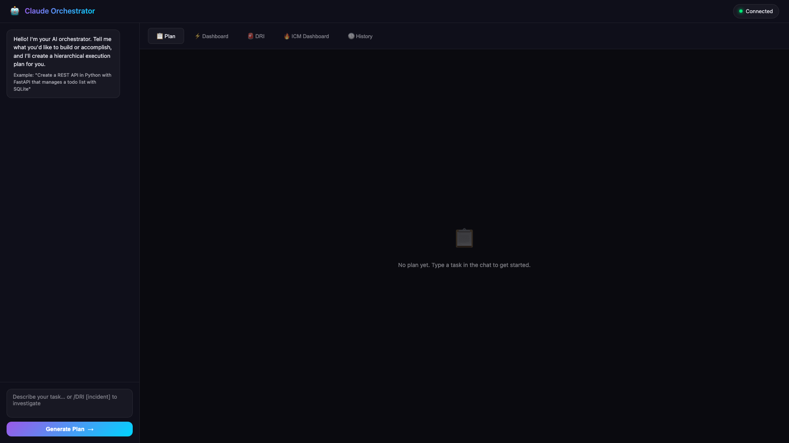
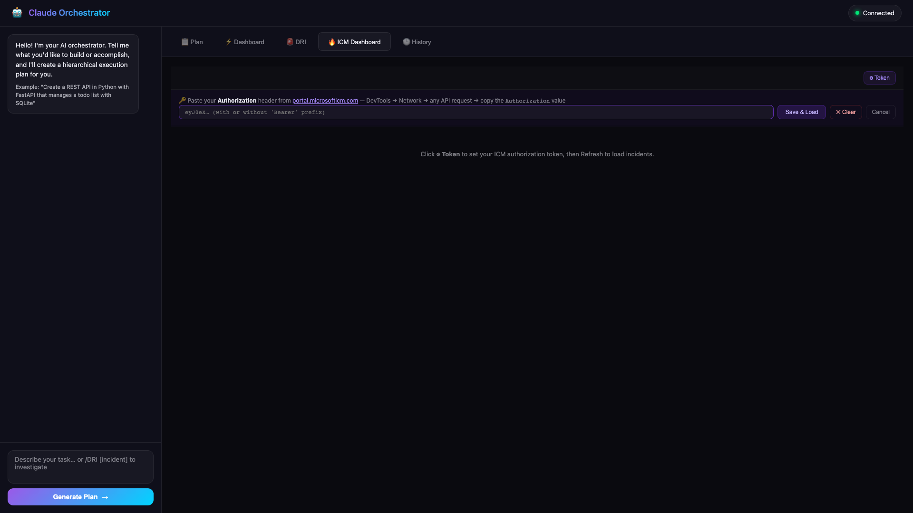
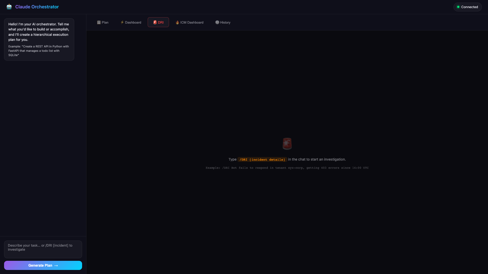

# 🧠 Claude Orchestrator

A local AI orchestration dashboard built on the **Anthropic Claude API**. It lets you describe high-level tasks and automatically breaks them into a hierarchical execution plan, runs sub-agents in parallel, and surfaces real-time results — all through a clean dark-glass web UI.

It also ships with a first-class **Microsoft ICM (Incident Management) Dashboard** and a **DRI Investigation** workflow for on-call engineers.

---

## Screenshots

### Plan & Chat


### ICM Dashboard


### DRI Investigation


---

## Features

| Feature | Description |
|---------|-------------|
| 🧠 **AI Orchestration** | Describe a task → Claude generates a hierarchical plan → sub-agents execute each step |
| ⚡ **Real-time Dashboard** | Live WebSocket updates as agents work through plan steps |
| 🔥 **ICM Dashboard** | Browse active Microsoft ICM incidents with Fluent Glass UI — severity badges, stats bar, team filters |
| 🚨 **DRI Investigation** | One-command `/DRI [incident]` workflow to kick off a structured on-call investigation |
| 📋 **History** | Persistent session history stored locally at `~/.orchestrator/history/` |
| 🎨 **Fluent Glass UI** | Deep blue/purple glassmorphism theme — gradient severity badges, glowing stat dots, smooth transitions |

---

## Tech Stack

- **Backend:** Node.js + Express + TypeScript
- **AI:** Anthropic Claude API (`@anthropic-ai/sdk`)
- **Real-time:** WebSockets (`ws`)
- **Frontend:** Vanilla HTML/CSS/JS (zero framework, zero build step)
- **ICM API:** `https://prod.microsofticm.com/api2/incidentapi`

---

## Prerequisites

- Node.js 18+
- An [Anthropic API key](https://console.anthropic.com/)
- (Optional) Microsoft ICM bearer token for the ICM Dashboard

---

## Setup

### 1. Clone

```bash
git clone https://github.com/RajuRoopani/orchestrator.git
cd orchestrator
```

### 2. Install dependencies

```bash
npm install
```

### 3. Configure environment

```bash
cp .env.example .env
```

Edit `.env` and set your Anthropic API key:

```env
ANTHROPIC_API_KEY=sk-ant-...
PORT=3333          # optional, default 3333
```

### 4. Build & start

```bash
npm run dev        # build TypeScript + start server
```

Or separately:

```bash
npm run build      # tsc → dist/
npm start          # node dist/index.js
```

Open **http://localhost:3333** in your browser.

---

## Usage

### AI Plan & Execute

1. Type a task description in the chat panel, e.g.:
   > *"Create a REST API in Python with FastAPI that manages a todo list with SQLite"*
2. Click **Generate Plan** — Claude breaks it into a hierarchical execution plan.
3. Watch the **Dashboard** tab as sub-agents execute each step in real time.

### DRI Investigation

Type in the chat:
```
/DRI Bot fails to respond in tenant xyz-corp, getting 403 errors since 14:00 UTC
```

This kicks off a structured DRI (Designated Responsible Individual) investigation workflow with automated triage steps.

### ICM Dashboard

1. Go to the **ICM Dashboard** tab.
2. Click **⚙ Token** in the top-right.
3. Paste your `Authorization` header value from `portal.microsofticm.com`
   (DevTools → Network → any API request → copy the `Authorization` header value).
4. Select your team from the dropdown and click **Save & Load**.

The dashboard shows:
- Severity 1/2/3/Active counts in the stats bar
- Per-incident severity badges, status pills, flags (Outage / CRI)
- Direct **🚨 Investigate** button to launch a DRI workflow for any incident

> **Token note:** Bearer tokens from the ICM portal expire. When you see a `401`, re-paste a fresh token via ⚙ Token. The token is stored in `localStorage` and automatically re-sent to the server on each page load.

---

## Project Structure

```
orchestrator/
├── src/
│   ├── index.ts            # Express server, REST API, ICM proxy, WebSocket setup
│   ├── orchestrator.ts     # AI plan generation using Claude
│   ├── executor.ts         # Plan execution engine (runs sub-agents)
│   ├── dri-orchestrator.ts # DRI investigation workflow
│   ├── ws-manager.ts       # WebSocket connection manager
│   └── models.ts           # Shared TypeScript types
├── public/
│   ├── index.html          # Single-page app shell
│   ├── app.js              # Frontend logic (tabs, ICM, DRI, WebSocket client)
│   └── styles.css          # Fluent Glass dark theme
├── commands/
│   └── DRI.md              # DRI slash command definition
├── docs/
│   └── screenshots/        # UI screenshots
├── .env.example
├── package.json
└── tsconfig.json
```

---

## API Reference

| Method | Endpoint | Description |
|--------|----------|-------------|
| `POST` | `/api/plan` | Generate a Claude execution plan |
| `POST` | `/api/execute` | Execute a plan step |
| `POST` | `/api/dri` | Start a DRI investigation |
| `POST` | `/api/icm/token` | Set ICM bearer token + team ID |
| `GET`  | `/api/icm/incidents` | Fetch active ICM incidents (cached 5 min) |
| `GET`  | `/api/history` | List past sessions |
| `WS`   | `/ws` | Real-time execution updates |

---

## Environment Variables

| Variable | Required | Default | Description |
|----------|----------|---------|-------------|
| `ANTHROPIC_API_KEY` | ✅ | — | Your Anthropic API key |
| `PORT` | ❌ | `3333` | HTTP server port |

---

## Development

```bash
npm run build       # compile TypeScript
npm run type-check  # type-check without emitting
npm run dev         # build + run (one command)
```

To watch for changes during development, use `tsc --watch` in one terminal and `node dist/index.js` in another, or add `nodemon` to the dev dependencies.

---

## License

MIT
